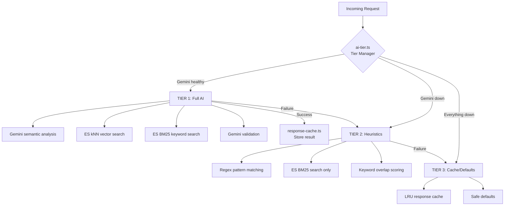

# AI Fallback Tier System — Implementation Plan (v2)

Argus currently has a single point of failure: every AI-powered function calls Gemini via `callGemini()` which throws on any HTTP error. If Gemini is down, rate-limited, or unreachable, **the entire ingestion pipeline and context-matching system breaks**.

This plan introduces a 3-tier degradation strategy — including **kNN vector search** in Tier 1 — so Argus always responds at varying quality levels.

## User Review Required

> [!IMPORTANT]
> **kNN requires embedding generation at ingestion time.** Every new event will trigger a Gemini embedding API call (~$0.000025 per event). If Gemini is down, embeddings are skipped and the event uses BM25-only search until embeddings can be backfilled.

> [!WARNING]
> **Index migration needed.** The current `argus-events` index has no `dense_vector` field. We need to either recreate the index (losing existing data) or use a reindex operation. Since the project uses a "Fresh Start" strategy, recreating is likely fine.

---

## Architecture Overview



**Tier escalation:**
- **1 Gemini failure** → Tier 2 for 30 seconds
- **3 consecutive failures** → Tier 2 for 5 minutes
- **10 consecutive failures** → Tier 3 for 15 minutes
- **Any Gemini success** → immediately reset to Tier 1
- Background health-check ping every 60s during cooldown

---

## Proposed Changes

### New Module: Embeddings

#### [NEW] [embeddings.ts](file:///d:/Elastic/whatsapp-chat-rmd-argus/argus/src/embeddings.ts)

Generates vector embeddings using Gemini's embedding API for kNN search.

**Functions:**
- `generateEmbedding(text: string): Promise<number[] | null>` — calls Gemini embedding API, returns 768-dim vector or `null` on failure
- `buildEventEmbeddingText(event): string` — concatenates `title + description + keywords + location` into a single string for embedding
- `backfillMissingEmbeddings(): Promise<number>` — finds events with no embedding and generates them (for recovery after Gemini outage)

**Embedding strategy:**
- Model: `text-embedding-004` (Google's latest, 768 dimensions)
- Input: `"{title}. {description}. Keywords: {keywords}. Location: {location}"`
- Called at ingestion time inside `insertEvent()` — if it fails, event is stored without embedding (BM25-only)
- Backfill runs on a 5-minute interval for events missing embeddings

---

### New Module: Tier Manager

#### [NEW] [ai-tier.ts](file:///d:/Elastic/whatsapp-chat-rmd-argus/argus/src/ai-tier.ts)

Central orchestrator that wraps every AI function with fallback logic.

**Key API:**
```typescript
// Generic fallback wrapper
withFallback<T>(tier1Fn, tier2Fn, tier3Fn): Promise<T>

// State
getCurrentTier(): 1 | 2 | 3
getAiStatus(): TierStatus   // for /api/ai-status endpoint
reportSuccess(): void        // called by callGemini on success
reportFailure(error): void   // called by callGemini on failure
```

**Config (env vars):**
- `AI_TIER_MODE`: `auto` | `tier1_only` | `tier2_only` | `tier3_only`
- `AI_COOLDOWN_BASE_SEC`: Base cooldown after failure (default: 30)

---

### New Module: Heuristic Fallbacks (Tier 2)

#### [NEW] [fallback-heuristics.ts](file:///d:/Elastic/whatsapp-chat-rmd-argus/argus/src/fallback-heuristics.ts)

Pure-algorithm replacements for each Gemini function. No API calls needed.

| Gemini Function | Tier 2 Replacement | Approach |
|:---|:---|:---|
| `analyzeMessage()` | `heuristicAnalyze()` | Regex for dates/times, services, action verbs, Hinglish patterns |
| `detectAction()` | `heuristicDetectAction()` | Pattern-match "cancel", "done", "ho gaya", "baad mein", etc. |
| `validateRelevance()` | `heuristicValidateRelevance()` | Keyword overlap score between URL keywords and event fields |
| `chatWithContext()` | `heuristicChat()` | Template responses listing matching events by keyword/date |
| `generatePopupBlueprint()` | Reuse existing `getDefaultPopupBlueprint()` | Already implemented in `gemini.ts` |

---

### New Module: Response Cache (Tier 3)

#### [NEW] [response-cache.ts](file:///d:/Elastic/whatsapp-chat-rmd-argus/argus/src/response-cache.ts)

In-memory LRU cache (max 500 entries, 1-hour TTL).

- On Tier 1 success → store result
- On Tier 3 → look up cache; if miss → return safe defaults

**Safe defaults (cache miss):**

| Function | Default |
|:---|:---|
| `analyzeMessage()` | `{ events: [] }` — no false events |
| `detectAction()` | `{ isAction: false }` — treat as new content |
| `validateRelevance()` | `{ relevant: [], confidence: 0 }` |
| `chatWithContext()` | `"I'm having trouble connecting. Ask again in a bit! 🔄"` |
| `generatePopupBlueprint()` | Existing `getDefaultPopupBlueprint()` templates |

---

### Modifications to Existing Files

#### [MODIFY] [elastic.ts](file:///d:/Elastic/whatsapp-chat-rmd-argus/argus/src/elastic.ts)

**Index mapping changes** — add `dense_vector` field to events index:
```diff
 keywords: { type: 'text', fields: { keyword: { type: 'keyword' } } },
+embedding: { type: 'dense_vector', dims: 768, index: true, similarity: 'cosine' },
 confidence: { type: 'float' },
```

**`insertEvent()`** — call `generateEmbedding()` and store the vector:
```diff
+import { generateEmbedding, buildEventEmbeddingText } from './embeddings.js';
 // Inside insertEvent():
+const embeddingText = buildEventEmbeddingText(event);
+const embedding = await generateEmbedding(embeddingText);
 await es.index({
   document: {
     ...existingFields,
+    embedding,  // null if generation failed
   }
 });
```

**New `hybridSearchEvents()`** — kNN + BM25 combined query:
```typescript
export async function hybridSearchEvents(
  queryText: string, queryVector: number[] | null,
  days = 90, limit = 10
): Promise<Event[]> {
  const query = { /* existing BM25 multi_match */ };
  const knn = queryVector ? {
    field: 'embedding', query_vector: queryVector,
    k: limit, num_candidates: 50,
    filter: { terms: { status: ['pending','scheduled','discovered'] } }
  } : undefined;
  // ES merges kNN + query scores automatically
}
```

#### [MODIFY] [gemini.ts](file:///d:/Elastic/whatsapp-chat-rmd-argus/argus/src/gemini.ts)

- Wrap `callGemini()` to report success/failure to tier manager
- Wrap each exported function with `withFallback()` orchestrator
- Export `getDefaultPopupBlueprint()` for Tier 2/3 reuse

#### [MODIFY] [server.ts](file:///d:/Elastic/whatsapp-chat-rmd-argus/argus/src/server.ts)

- Add `GET /api/ai-status` endpoint returning current tier, health, and stats
- Update `/api/health` to include `aiTier` field
- Initialize tier manager and embedding backfill at startup

#### [MODIFY] [types.ts](file:///d:/Elastic/whatsapp-chat-rmd-argus/argus/src/types.ts)

- Add new env vars to `parseConfig()`: `AI_TIER_MODE`, `AI_COOLDOWN_BASE_SEC`, `AI_CACHE_TTL_SEC`, `AI_CACHE_MAX_SIZE`, `GEMINI_EMBEDDING_MODEL`

#### [MODIFY] [.env](file:///d:/Elastic/whatsapp-chat-rmd-argus/argus/.env)

```env
# AI Fallback Tier config
AI_TIER_MODE=auto
AI_COOLDOWN_BASE_SEC=30
AI_CACHE_TTL_SEC=3600
AI_CACHE_MAX_SIZE=500
GEMINI_EMBEDDING_MODEL=text-embedding-004
```

---

## Files Changed Summary

| File | Action | Purpose |
|:---|:---|:---|
| `embeddings.ts` | **NEW** | Gemini embedding generation + backfill for kNN |
| `ai-tier.ts` | **NEW** | Tier selection engine, health monitor, `withFallback()` |
| `fallback-heuristics.ts` | **NEW** | Tier 2 regex/pattern replacements for all 5 Gemini functions |
| `response-cache.ts` | **NEW** | Tier 3 LRU cache + safe defaults |
| `elastic.ts` | MODIFY | Add `embedding` field to index, add `hybridSearchEvents()`, update `insertEvent()` |
| `gemini.ts` | MODIFY | Wrap functions with fallback, export default popup blueprint |
| `server.ts` | MODIFY | Add `/api/ai-status`, init tier manager + backfill |
| `types.ts` | MODIFY | Add new env vars to config |
| `.env` | MODIFY | Add tier + embedding config vars |

---

## Verification Plan

### Automated
```bash
cd d:\Elastic\whatsapp-chat-rmd-argus\argus && npx tsc --noEmit
```

### Manual

1. **Tier 1 (normal)** — Start with valid API keys, send webhook message → confirm event extracted + embedding generated + `GET /api/ai-status` returns `currentTier: 1`

2. **kNN search** — After ingesting events, hit `POST /api/context-check` → confirm hybrid search returns results with higher relevance scores than BM25 alone

3. **Tier 2 (Gemini down)** — Set `GEMINI_API_KEY` to invalid, send webhook "meeting tomorrow at 5pm" → confirm heuristic extracts a meeting event, `ai-status` shows `currentTier: 2`

4. **Tier 3 (total failure)** — Break both API keys → confirm safe defaults returned, no crashes, `currentTier: 3`

5. **Recovery** — Restore valid keys → confirm auto-recovery to Tier 1, backfill generates missing embeddings
