# Argus — System Architecture

> **Argus** is a proactive memory assistant that monitors WhatsApp conversations, extracts events and actions using Gemini AI, stores them in SQLite, and surfaces contextual reminders through a Chrome extension.

## Architecture Diagram

```mermaid
flowchart TB
    %% ============ EXTERNAL SOURCES ============
    WA["WhatsApp User Messages"]
    CHROME["Chrome Browser Tabs"]

    %% ============ EVOLUTION API LAYER ============
    subgraph EVOL_LAYER ["Evolution API Layer"]
        direction TB
        EVOL["Evolution API :8080"]
        PG[("PostgreSQL DB")]
        EVOL <--> PG
    end

    %% ============ ARGUS SERVER ============
    subgraph ARGUS_SERVER ["Argus Server :3000"]
        direction TB

        subgraph INGESTION ["Message Ingestion Pipeline"]
            direction TB
            WH["Webhook Receiver /api/webhook/whatsapp"]
            CLASSIFY["classifyMessage - Quick Filter"]
            DETECT["detectAction - NLP Action Detection"]
            EXTRACT["extractEvents - Gemini Event Extraction"]
            PROCESS["processMessage - Orchestrator"]

            WH --> PROCESS
            PROCESS --> CLASSIFY
            CLASSIFY -->|"Has action pattern"| DETECT
            CLASSIFY -->|"Has event keywords"| EXTRACT
            DETECT -->|"No action found"| EXTRACT
            DETECT -->|"Action found"| ACTION_EXEC["Execute Action on DB"]
        end

        subgraph AI_ENGINE ["Gemini AI Engine"]
            direction TB
            GEMINI_API["Gemini 2.5 Flash Preview"]
            CHAT_CTX["chatWithContext - AI Chat"]
            MATCH_VAL["matchContext - URL Validator"]
        end

        subgraph SCHEDULER_SYS ["Scheduler System"]
            direction TB
            TIME_TRIG["checkTimeTriggers - 60s interval"]
            DUE_REM["checkDueReminders - 30s interval"]
            SNOOZE_CHK["checkSnoozedEvents - 30s interval"]
        end

        subgraph DATA_LAYER ["Data Layer"]
            direction TB
            SQLITE[("SQLite + FTS5")]
            DB_OPS["db.ts - CRUD Operations"]
            DB_OPS <--> SQLITE
        end

        subgraph API_ENDPOINTS ["REST API"]
            direction TB
            EP_EVENTS["/api/events"]
            EP_STATS["/api/stats"]
            EP_ACTIONS["/api/events/:id/action"]
            EP_CHAT["/api/chat"]
            EP_CONTEXT["/api/context-check"]
            EP_HEALTH["/api/health"]
        end

        WS_SERVER["WebSocket Server /ws"]
    end

    %% ============ CHROME EXTENSION ============
    subgraph EXTENSION ["Chrome Extension - Manifest V3"]
        direction TB

        subgraph BG_WORKER ["Service Worker"]
            direction TB
            BG["background.js v2.4"]
            WS_CLIENT["WebSocket Client"]
            BG <--> WS_CLIENT
        end

        subgraph CONTENT ["Content Script"]
            direction TB
            CS["content.js"]
            POPUP_MGR["Dynamic Popup Manager"]
            TOAST["Toast Notifications"]
            CS --> POPUP_MGR
            CS --> TOAST
        end

        subgraph SIDEPANEL ["AI Chat Sidebar"]
            direction TB
            SP_HTML["sidepanel.html"]
            SP_JS["sidepanel.js"]
            SP_HTML <--> SP_JS
        end

        subgraph EXT_POPUP ["Extension Popup"]
            direction TB
            POP_HTML["popup.html"]
            POP_JS["popup.js"]
            POP_HTML <--> POP_JS
        end
    end

    %% ============ CONNECTIONS ============
    WA -->|"messages"| EVOL
    EVOL -->|"webhook POST"| WH

    EXTRACT -->|"AI call"| GEMINI_API
    DETECT -->|"AI call"| GEMINI_API
    CHAT_CTX -->|"AI call"| GEMINI_API

    EXTRACT --> DB_OPS
    ACTION_EXEC --> DB_OPS

    TIME_TRIG --> DB_OPS
    DUE_REM --> DB_OPS
    SNOOZE_CHK --> DB_OPS

    SCHEDULER_SYS -->|"broadcast events"| WS_SERVER

    WS_CLIENT <-->|"WebSocket :3000/ws"| WS_SERVER
    WS_CLIENT -->|"popup data"| CS
    WS_CLIENT -->|"notifications"| BG

    EP_CHAT -->|"query"| CHAT_CTX
    EP_CONTEXT -->|"validate"| MATCH_VAL
    EP_ACTIONS --> DB_OPS
    EP_EVENTS --> DB_OPS
    EP_STATS --> DB_OPS

    SP_JS -->|"POST /api/chat"| EP_CHAT
    POP_JS -->|"GET /api/events"| EP_EVENTS
    POP_JS -->|"GET /api/stats"| EP_STATS
    CS -->|"POST /api/events/:id/action"| EP_ACTIONS

    CHROME -->|"URL changes"| BG
    BG -->|"POST /api/context-check"| EP_CONTEXT
    EP_CONTEXT -->|"matching events"| BG
    BG -->|"context popup"| CS

    MATCH_VAL -->|"AI validation"| GEMINI_API
    MATCH_VAL --> DB_OPS
```



---

## Component Breakdown

### 1. Evolution API Layer
| Component | Port | Purpose |
|-----------|------|---------|
| Evolution API | `:8080` | WhatsApp Web bridge (Baileys) — receives/sends WhatsApp messages |
| PostgreSQL | `:5432` | Stores Evolution API state, sessions, contacts |

### 2. Argus Server (`src/`)
| File | Purpose |
|------|---------|
| `server.ts` | Express + WebSocket server, all REST endpoints, webhook handler |
| `ingestion.ts` | Message processing pipeline: classify → detect action → extract events |
| `gemini.ts` | All Gemini AI calls: extractEvents, detectAction, classifyMessage, chatWithContext, matchContext |
| `db.ts` | SQLite + FTS5 CRUD, migrations, search, context queries |
| `scheduler.ts` | Three interval loops: time triggers (60s), due reminders (30s), snoozed events (30s) |
| `matcher.ts` | URL pattern matching, context extraction, Gemini-validated URL-to-event matching |
| `types.ts` | Zod schemas, TypeScript types, EventStatusEnum, event type definitions |

### 3. Chrome Extension (`extension/`)
| File | Purpose |
|------|---------|
| `manifest.json` | Manifest V3 config — permissions: sidePanel, activeTab, tabs, storage |
| `background.js` | Service worker — WebSocket client, tab URL monitoring, API calls, sidePanel handler |
| `content.js` | Injected into all pages — dynamic popup overlays (5 types), toast notifications, action handlers |
| `sidepanel.html/js` | AI Chat sidebar — markdown rendering, context-aware conversations, quick actions |
| `popup.html/js` | Extension popup — event cards with stats, action buttons, auto-refresh |

### 4. Data Flow

```
WhatsApp Message
    → Evolution API (Baileys)
    → Webhook POST to Argus /api/webhook/whatsapp
    → classifyMessage() — quick keyword/pattern filter
    → detectAction() — NLP action recognition (mark done, cancel, etc.)
    → extractEvents() — Gemini AI event extraction (7 types)
    → SQLite (FTS5 full-text search)
    → Scheduler checks (time triggers, reminders, snooze)
    → WebSocket broadcast to Chrome Extension
    → Dynamic popup overlay on active browser tab
```

### 5. Event Status Lifecycle

```
discovered → scheduled → reminded → completed
    ↓            ↓
  snoozed     snoozed
    ↓            ↓
  ignored     expired
```

| Status | Meaning |
|--------|---------|
| `discovered` | New event from WhatsApp — needs user action |
| `scheduled` | User approved — will get context reminders and 1hr-before notifications |
| `snoozed` | User said "later" — will remind again in 30 minutes |
| `ignored` | User dismissed — hidden but not deleted |
| `reminded` | 1-hour-before reminder was shown |
| `completed` | User marked as done |
| `expired` | Event time passed without action |
| `pending` | Legacy/fallback status |

### 6. Event Types (Gemini Extraction)

| Type | Example |
|------|---------|
| `meeting` | "Team standup tomorrow at 10am" |
| `deadline` | "Project deadline Friday 5pm" |
| `reminder` | "Don't forget to call grandma" |
| `travel` | "Trip to Manali next month" |
| `task` | "Buy groceries, pick up laundry" |
| `subscription` | "Cancel Spotify subscription" |
| `recommendation` | "Try biryani at Meghana Foods" |

### 7. Popup Types (Chrome Extension)

| Type | Trigger | Content |
|------|---------|---------|
| `notification` | New event discovered | Event details + Schedule/Snooze/Ignore buttons |
| `trigger` | Scheduled time approaching | Reminder with Complete/Snooze/Dismiss buttons |
| `context` | URL matches event context | "Relevant event" card with action buttons |
| `conflict_warning` | Calendar conflict detected | Warning with conflicting events |
| `action_performed` | NLP action executed | Confirmation toast of action taken |

### 8. API Endpoints

| Endpoint | Method | Purpose |
|----------|--------|---------|
| `/api/health` | GET | Health check |
| `/api/stats` | GET | Event statistics |
| `/api/events` | GET | List events (filter by status) |
| `/api/events/:id/set-reminder` | POST | Schedule event |
| `/api/events/:id/snooze` | POST | Snooze for X minutes |
| `/api/events/:id/ignore` | POST | Ignore event |
| `/api/events/:id/complete` | POST | Mark done |
| `/api/events/:id/dismiss` | POST | Dismiss notification |
| `/api/events/:id/acknowledge` | POST | Acknowledge reminder |
| `/api/events/:id` | DELETE | Delete permanently |
| `/api/webhook/whatsapp` | POST | WhatsApp webhook |
| `/api/context-check` | POST | Check URL context |
| `/api/chat` | POST | AI Chat conversation |
| `/ws` | WS | Real-time event notifications |

### 9. Tech Stack

| Layer | Technology |
|-------|------------|
| Runtime | Node.js 22 (Alpine) |
| Server | Express.js + ws (WebSocket) |
| AI | Gemini 2.5 Flash Preview (OpenAI-compatible endpoint) |
| Database | SQLite + FTS5 (better-sqlite3) |
| WhatsApp | Evolution API v2.x (Baileys) |
| Extension | Chrome Manifest V3 (service worker) |
| Type System | TypeScript + Zod validation |
| Dev Tools | tsx (watch mode), Vitest (testing) |
| Containerization | Docker Compose |
