# Argus — System Architecture

> **Argus** is a proactive memory assistant that monitors WhatsApp conversations, extracts events and actions using Gemini AI, stores them in Elasticsearch Serverless, and surfaces contextual reminders through a Chrome extension. It includes a 3-tier AI fallback system, hybrid kNN+BM25 search, and automated daily backups.

## Architecture Diagram

```mermaid
flowchart TB
    %% ============ EXTERNAL SOURCES ============
    WA["WhatsApp User Messages"]
    CHROME["Chrome Browser Tabs"]
    GEMINI_API["Gemini API\n(gemini-3-flash-preview)"]
    ELASTIC_CLOUD[("Elasticsearch Serverless\n(Cloud)")]

    %% ============ EVOLUTION API LAYER ============
    subgraph EVOL_LAYER ["Evolution API Layer"]
        direction TB
        EVOL["Evolution API :8080"]
        PG[("PostgreSQL DB")]
        EVOL <--> PG
    end

    %% ============ ARGUS SERVER ============
    subgraph ARGUS_SERVER ["Argus Server :3000"]
        direction TB

        subgraph INGESTION ["Message Ingestion Pipeline"]
            direction TB
            WH["Webhook Receiver\n/api/webhook/whatsapp"]
            CLASSIFY["classifyMessage\nQuick Filter"]
            DETECT["detectAction\nNLP Action Detection"]
            EXTRACT["extractEvents\nEvent Extraction"]
            PROCESS["processMessage\nOrchestrator"]

            WH --> PROCESS
            PROCESS --> CLASSIFY
            CLASSIFY -->|"Has action pattern"| DETECT
            CLASSIFY -->|"Has event keywords"| EXTRACT
            DETECT -->|"No action found"| EXTRACT
            DETECT -->|"Action found"| ACTION_EXEC["Execute Action"]
        end

        subgraph AI_TIER_SYS ["AI Fallback Tier System"]
            direction TB
            TIER_MGR["ai-tier.ts\nTier Manager"]
            T1["Tier 1\nGemini AI (full)"]
            T2["Tier 2\nRegex Heuristics"]
            T3["Tier 3\nSafe Defaults + Cache"]
            TIER_MGR --> T1
            TIER_MGR -->|"cooldown active"| T2
            TIER_MGR -->|"10+ failures"| T3
        end

        subgraph AI_ENGINE ["Gemini AI Engine"]
            direction TB
            GEMINI_CALL["gemini.ts\nwithFallback() wrapper"]
            CHAT_CTX["chatWithContext\nAI Chat"]
            EMBED_GEN["embeddings.ts\ngenerateEmbedding()"]
        end

        subgraph SCHEDULER_SYS ["Scheduler System"]
            direction TB
            TIME_TRIG["checkTimeTriggers\n60s interval"]
            DUE_REM["checkDueReminders\n30s interval"]
            SNOOZE_CHK["checkSnoozedEvents\n30s interval"]
            RETRY_Q["processRetryQueue\n30s interval"]
            BACKUP_JOB["runDailyBackup\n24h interval"]
        end

        subgraph DATA_LAYER ["Data Layer"]
            direction TB
            ES_OPS["elastic.ts\nCRUD + Search"]
            HYBRID["hybridSearchEvents()\nkNN + BM25 + RRF"]
            ES_OPS <--> HYBRID
        end

        subgraph BACKUP_SYS ["Backup System"]
            direction TB
            BACKUP["backup.ts\nexport / import / prune"]
            DEAD_LETTER["data/dead-letter.jsonl\nFailed write recovery"]
            FAILED_REM["data/failed-reminders.jsonl\nUndelivered notifications"]
        end

        subgraph ERROR_SYS ["Error Handling"]
            direction TB
            SAFE_ASYNC["safeAsync()\nCatch + fallback"]
            WITH_RETRY["withRetry()\n1 retry, 45s budget"]
            FETCH_TO["fetchWithTimeout()\n30s AbortController"]
        end

        subgraph API_ENDPOINTS ["REST API"]
            direction TB
            EP_HEALTH["/api/health"]
            EP_AI_STATUS["/api/ai-status"]
            EP_STATS["/api/stats"]
            EP_EVENTS["/api/events/*"]
            EP_CHAT["/api/chat"]
            EP_CONTEXT["/api/context-check"]
            EP_BACKUP["/api/backup/*"]
            EP_WA["/api/whatsapp/*"]
        end

        WS_SERVER["WebSocket Server /ws"]
    end

    %% ============ CHROME EXTENSION ============
    subgraph EXTENSION ["Chrome Extension — Manifest V3"]
        direction TB

        subgraph BG_WORKER ["Service Worker"]
            BG["background.js"]
            WS_CLIENT["WebSocket Client"]
            BG <--> WS_CLIENT
        end

        subgraph CONTENT ["Content Script"]
            CS["content.js"]
            POPUP_MGR["Popup Manager\n(8 popup types)"]
            CS --> POPUP_MGR
        end

        subgraph SIDEPANEL ["AI Chat Sidebar"]
            SP_JS["sidepanel.html/js"]
        end

        subgraph EXT_POPUP ["Extension Popup"]
            POP_JS["popup.html/js\n+ Export Backup button"]
        end
    end

    %% ============ CONNECTIONS ============
    WA -->|"messages"| EVOL
    EVOL -->|"webhook POST"| WH

    EXTRACT -->|"AI call via withFallback()"| TIER_MGR
    DETECT -->|"AI call via withFallback()"| TIER_MGR
    TIER_MGR --> GEMINI_CALL
    GEMINI_CALL -->|"Tier 1"| GEMINI_API
    GEMINI_CALL -.->|"failure reported"| TIER_MGR

    CHAT_CTX -->|"AI call"| GEMINI_API
    EMBED_GEN -->|"embedContent API"| GEMINI_API

    EXTRACT --> ES_OPS
    EXTRACT --> EMBED_GEN
    EMBED_GEN --> ES_OPS
    ACTION_EXEC --> ES_OPS

    TIME_TRIG --> ES_OPS
    DUE_REM --> ES_OPS
    SNOOZE_CHK --> ES_OPS
    RETRY_Q --> WS_SERVER
    BACKUP_JOB --> BACKUP

    SAFE_ASYNC --> DEAD_LETTER
    RETRY_Q --> FAILED_REM

    ES_OPS <-->|"HTTPS"| ELASTIC_CLOUD
    HYBRID <-->|"kNN + BM25"| ELASTIC_CLOUD
    BACKUP <-->|"export/import"| ELASTIC_CLOUD

    SCHEDULER_SYS -->|"broadcast"| WS_SERVER
    WS_CLIENT <-->|"WebSocket :3000/ws"| WS_SERVER
    WS_CLIENT -->|"popup data"| CS

    EP_CHAT --> CHAT_CTX
    CHAT_CTX --> HYBRID
    EP_CONTEXT --> HYBRID
    EP_EVENTS --> ES_OPS
    EP_STATS --> ES_OPS
    EP_BACKUP --> BACKUP
    EP_AI_STATUS --> TIER_MGR

    SP_JS -->|"POST /api/chat"| EP_CHAT
    POP_JS -->|"GET /api/events"| EP_EVENTS
    POP_JS -->|"GET /api/stats"| EP_STATS
    POP_JS -->|"GET /api/backup/export"| EP_BACKUP
    CS -->|"POST /api/events/:id/action"| EP_EVENTS

    CHROME -->|"URL changes"| BG
    BG -->|"POST /api/context-check"| EP_CONTEXT
    EP_CONTEXT -->|"matching events"| BG
    BG -->|"context popup"| CS
```



---

## Component Breakdown

### 1. Evolution API Layer

| Component | Port | Purpose |
|-----------|------|---------|
| Evolution API | `:8080` | WhatsApp Web bridge (Baileys) — receives/sends messages |
| PostgreSQL | `:5432` | Stores Evolution API sessions, contacts, state |

### 2. Argus Server (`src/`)

| File | Purpose |
|------|---------|
| `server.ts` | Express + WebSocket server, all REST endpoints, startup bootstrap |
| `ingestion.ts` | Message processing pipeline: classify → detect action → extract events |
| `gemini.ts` | All Gemini AI calls wrapped with `withFallback()`: extractEvents, detectAction, chatWithContext, generatePopupBlueprint, validateRelevance |
| `elastic.ts` | All Elasticsearch operations: CRUD, hybrid search, embedding backfill helpers, stats |
| `ai-tier.ts` | AI fallback tier manager: tracks failures, cooldowns, background health pings |
| `fallback-heuristics.ts` | Tier 2 pure-regex replacements for all 5 Gemini functions |
| `response-cache.ts` | Tier 3 LRU response cache (configurable TTL and max size) |
| `embeddings.ts` | Gemini `embedContent` API calls (768-dim `gemini-embedding-001`) |
| `backup.ts` | Export / import / prune backup logic for all 6 Elasticsearch indices |
| `scheduler.ts` | Interval loops: time triggers (60s), reminders + retry queue (30s), snooze (30s), daily backup (24h) |
| `matcher.ts` | URL pattern matching and context extraction for browser trigger checks |
| `errors.ts` | `fetchWithTimeout`, `withRetry`, `safeAsync`, `logDeadLetter`, `logFailedReminder`, custom error classes |
| `quicksave.ts` | QuickSave CEP v9.1 — token compression for AI prompts |
| `evolution-db.ts` | Direct PostgreSQL read access for Evolution API message history |
| `types.ts` | Zod schemas, TypeScript types, `parseConfig()` |

### 3. Elasticsearch Indices

| Index | Key Fields | Purpose |
|-------|-----------|---------|
| `argus-events` | `title`, `keywords`, `embedding` (768-dim), `status`, `event_time` | All extracted events/tasks/reminders |
| `argus-messages` | `content`, `chat_id`, `sender`, `timestamp` | Raw WhatsApp messages |
| `argus-triggers` | `trigger_type`, `trigger_value`, `is_fired`, `event_id` | Time and URL-based notification triggers |
| `argus-contacts` | `id`, `name`, `message_count` | Contact list with activity counters |
| `argus-context-dismissals` | `event_id`, `url_pattern`, `dismissed_until` | Per-URL 30-minute dismissal suppression |
| `argus-push-subscriptions` | subscription tokens | Browser push notification subscriptions |

### 4. AI Fallback Tier System

| Tier | Activation | Behavior |
|------|------------|----------|
| **1** — Gemini | Normal operation | Full Gemini AI extraction and analysis |
| **2** — Heuristics | 1+ failures (cooldown active) | Regex/pattern replacements for all 5 AI functions |
| **3** — Cache/Default | 10+ consecutive failures | LRU response cache; safe defaults if cache miss |

Cooldown schedule: 1 failure → 30s, 3 consecutive → 5min, 10 consecutive → 15min.
Recovery to Tier 1 is immediate on any successful Gemini call.
A background health ping runs every 60s during cooldown to detect recovery.

### 5. Chrome Extension (`extension/`)

| File | Purpose |
|------|---------|
| `manifest.json` | Manifest V3 — permissions: sidePanel, activeTab, tabs, storage, notifications |
| `background.js` | Service worker — WebSocket client, tab URL monitoring, API calls |
| `content.js` | Injected into all pages — 8 popup overlay types, DOM form watcher |
| `sidepanel.html/js` | AI Chat sidebar — context-aware conversation, markdown rendering |
| `popup.html/js` | Extension popup — event cards, stats, Export Backup button |

### 6. Data Flow

```
WhatsApp Message
    → Evolution API (Baileys)
    → Webhook POST /api/webhook/whatsapp
    → classifyMessage()      — quick keyword/pattern filter
    → detectAction()         — NLP action recognition (via withFallback → Tier 1/2/3)
    → extractEvents()        — event extraction (via withFallback → Tier 1/2/3)
    → generateEmbedding()    — 768-dim vector (silent failure → BM25-only fallback)
    → Elasticsearch          — indexed with dense_vector embedding
    → Scheduler              — time triggers, reminders, snooze checks
    → WebSocket broadcast    → Chrome Extension
    → Dynamic popup overlay  — on active browser tab
```

```
Browser URL Change
    → background.js detects navigation
    → POST /api/context-check { url, title, keywords }
    → hybridSearchEvents()   — kNN (semantic) + BM25 (keyword) merged via RRF
    → matching events returned
    → context_reminder popup shown
```

### 7. Event Status Lifecycle

```
discovered → scheduled → reminded → completed
    ↓            ↓
  snoozed     snoozed
    ↓            ↓
  ignored     expired
```

| Status | Meaning |
|--------|---------|
| `discovered` | New event from WhatsApp — awaiting user action |
| `scheduled` | User approved — will receive time and context reminders |
| `snoozed` | Deferred — will reappear after snooze duration |
| `ignored` | User dismissed — hidden but not deleted |
| `reminded` | 1-hour-before reminder was delivered |
| `completed` | User marked as done |
| `expired` | Event time passed without action |
| `pending` | Fallback/legacy status |

### 8. Event Types

| Type | Example |
|------|---------|
| `meeting` | "Team standup tomorrow at 10am" |
| `deadline` | "Project deadline Friday 5pm" |
| `reminder` | "Don't forget to call grandma" |
| `travel` | "Trip to Manali next month" |
| `task` | "Buy groceries, pick up laundry" |
| `subscription` | "Cancel Spotify subscription" |
| `recommendation` | "Try biryani at Meghana Foods" |
| `other` | Catch-all for unclassified events |

### 9. Popup Types (8)

| Type | Trigger |
|------|---------|
| `event_discovery` | New event detected from WhatsApp |
| `event_reminder` | Time-based (24h, 1h, 15min before event) |
| `context_reminder` | URL matches event's `context_url` or `location` |
| `conflict_warning` | Overlapping events within 60-minute window |
| `insight_card` | Suggestion or recommendation surfaced |
| `snooze_reminder` | Snoozed event becomes due again |
| `update_confirm` | Incoming message suggests modifying an existing event |
| `form_mismatch` | DOM form field contradicts WhatsApp memory |

### 10. Scheduler Retry

Failed WebSocket deliveries are placed in an in-memory retry queue with exponential backoff:

| Attempt | Delay |
|---------|-------|
| 1st retry | 1 minute |
| 2nd retry | 5 minutes |
| 3rd retry | 15 minutes |

After 3 failed attempts the notification is permanently logged to `data/failed-reminders.jsonl`.
The queue is drained every 30s alongside the due-reminders check.

### 11. Error Handling

| Utility | Behaviour |
|---------|-----------|
| `fetchWithTimeout(url, opts, 30s)` | AbortController deadline on every `fetch()` call |
| `withRetry(fn, opts)` | 1 retry with exponential backoff; 30s first attempt, 15s retry (≤45s total) |
| `safeAsync(fn, fallback, ctx)` | Catch-and-fallback; dead-letters the payload on failure |
| `logDeadLetter(op, data, err)` | Appends to `data/dead-letter.jsonl`; auto-rotates at 10 MB |

Retryable errors: `TimeoutError`, `GeminiApiError` (5xx / 429), network errors (`ECONNREFUSED`, `ENOTFOUND`, `fetch failed`, `socket hang up`, `ETIMEDOUT`).
Non-retryable: 4xx client errors (except 429).

### 12. Backup System

| Operation | Detail |
|-----------|--------|
| Daily export | Runs 60s after startup, then every 24h; saves to `data/backups/argus-backup-YYYY-MM-DD.json` |
| Retention | Oldest files pruned to keep last `BACKUP_RETENTION_DAYS` (default 7) |
| Scope | All 6 indices; `embedding` field excluded (regenerable via backfill) |
| Import modes | `merge` (upsert) or `replace` (wipe then bulk-index in batches of 500) |
| Fast listing | `counts` placed before `indices` in JSON — header read (400 bytes) captures counts without parsing full file |
| Manual trigger | Extension popup Export Backup button → `GET /api/backup/export` |

### 13. API Endpoints

| Endpoint | Method | Purpose |
|----------|--------|---------|
| `/api/health` | GET | Health check (`aiTier`, `aiTierMode` included) |
| `/api/ai-status` | GET | Current tier, consecutive failures, cache stats, cooldown info |
| `/api/stats` | GET | Event and message statistics |
| `/api/events` | GET | List events (filter by `?status=`) |
| `/api/events/:id` | GET / PATCH / DELETE | Read, update, or delete event |
| `/api/events/:id/set-reminder` | POST | Schedule reminder triggers |
| `/api/events/:id/snooze` | POST | Snooze for X minutes |
| `/api/events/:id/ignore` | POST | Ignore event |
| `/api/events/:id/complete` | POST | Mark done |
| `/api/events/:id/dismiss` | POST | Dismiss notification |
| `/api/events/:id/acknowledge` | POST | Acknowledge reminder |
| `/api/events/:id/confirm-update` | POST | Confirm pending AI-suggested update |
| `/api/events/:id/context-url` | POST | Set context URL trigger |
| `/api/events/day/:timestamp` | GET | Events for a specific day |
| `/api/events/status/:status` | GET | Events filtered by status |
| `/api/backup/export` | GET | Download full JSON snapshot |
| `/api/backup/list` | GET | List local backup files with counts |
| `/api/backup/import` | POST | Import from JSON body |
| `/api/backup/restore/:filename` | POST | Restore from saved backup file |
| `/api/whatsapp/messages` | GET | Messages from Evolution API |
| `/api/whatsapp/search` | GET | Search messages (`?q=`) |
| `/api/whatsapp/contacts` | GET | Contact list |
| `/api/whatsapp/chats` | GET | Chat list |
| `/api/whatsapp/instances` | GET | Evolution API instance status |
| `/api/whatsapp/stats` | GET | WhatsApp statistics |
| `/api/chat` | POST | AI Chat — hybrid search + Gemini response |
| `/api/context-check` | POST | Check URL against events (kNN + BM25) |
| `/api/form-check` | POST | Check DOM form field against memory |
| `/api/extract-context` | POST | Extract context from URL |
| `/api/webhook/whatsapp` | POST | Evolution API webhook receiver |
| `/ws` | WebSocket | Real-time push to Chrome extension |

### 14. Tech Stack

| Layer | Technology |
|-------|------------|
| Runtime | Node.js 22 (Alpine) |
| Server | Express.js + ws (WebSocket) |
| AI | Gemini (OpenAI-compatible endpoint, `gemini-3-flash-preview`) |
| Embeddings | Gemini `embedContent` API (`gemini-embedding-001`, 768-dim cosine) |
| Database | Elasticsearch Serverless (`@elastic/elasticsearch`) |
| Search | Hybrid kNN + BM25 merged via Reciprocal Rank Fusion (RRF) |
| WhatsApp | Evolution API v2.x (Baileys) |
| Extension | Chrome Manifest V3 (service worker + content script) |
| Type System | TypeScript + Zod validation |
| Dev Tools | tsx (watch mode), Vitest (testing) |
| Containerization | Docker Compose (4 containers) |
